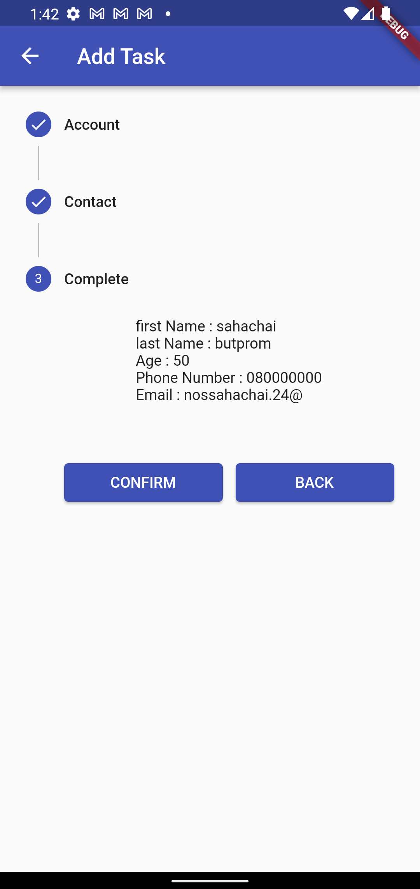

# Flutter project

> ## **Flutter Stepper From** 
---

- `แอปพลิเคชัน To Do List`
- `Stepper From` เก็บข้อมูลบุคคล
- `แสดงรายชื่อทั้งหมด และแสดงรายละเอียดของแต่ละบุคคล`

---
> ### _รูปลักษณ์ภายในแอปพลิเคชัน_

-  หน้าจอแสดงข้อมูลรายชื่อ และสามารถ `ลบ` รายการที่แสดงได้โดยกด `ไอคอนถังขยะ` 
---
 

- หน้าจอแสดงแบบฟอร์ม กรอกข้อมูลบุคคล 
---

- หน้าจอแสดงรายละเอียดของรายการที่ถูกเลือก 
---

